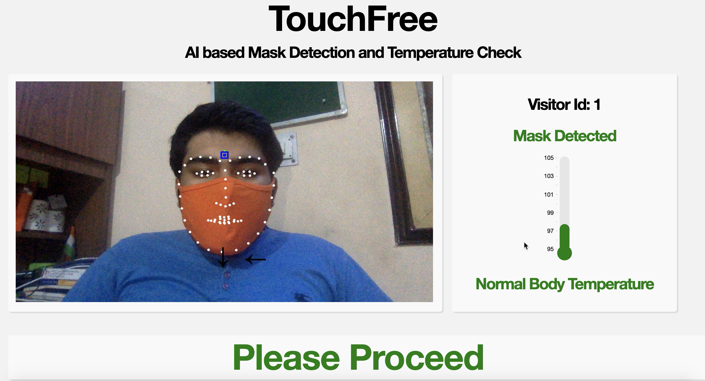
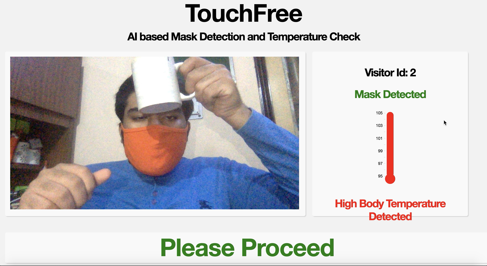
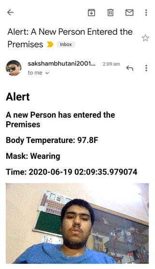

# TouchFree v2: AI-based Mask Detection and Temperature Check
  

### Explanation
Firstly, the Tensorflow based Deep Learning Neural Network tries to detect if the person is wearing a Mask or not. The System has been made Robust by training it with many different examples to prevent False Positives.

Once, the System has detected the Mask it performs Facial Landmarking. The System is using DLIB Module for Facial Landmarking to find the best Spot on the Forehead of the person to take Temperature from.

Then by using PID Control System with Servo Motors, the system tries to align the Selected Spot on the Forehead with the Sensor OR if in self align mode the User can align himself based on the visual clues. Once aligned the system takes Temperature Reading using Contactless IR Temperature Sensor.

If the temperature is within normal Human Body Temperature range it allows the Person to Proceed and sends an email to the Admin with a Picture and other Details like Body Temperature, etc.

### Setup for PC (Windows/Mac/Linux)
* Install Python
* Download the Code and the Required Files
    * Download the Code as [Zip from Github.](https://github.com/saksham2001/TouchFree-v2/archive/master.zip)
    * Or by using command `git clone https://github.com/saksham2001/TouchFree-v2`  
* Install Requirements by running command  
`pip install -r requirements.txt`
* Enable Less Secure App Access from [here](https://myaccount.google.com/lesssecureapps) 
or Create an App Specific Password [here.](https://support.google.com/accounts/answer/185833)
* Save the Sender's email Address, Password and Email Permission as Local Variables.  
`export SEND_EMAIL="TRUE"  
export EMAIL_ID="your-email-here"   
export EMAIL_PWD="your-password-here"`   
* Or If you do not want Email Feature just add Email Permission as Local Variable
`export SEND_EMAIL="FALSE"`   
Note- For PC Version you have to design your own approach for temperature measurement and add the code to `temp_check` in line 36 of `app.py`

### Setup for BalenaFin/ Raspberry Pi 
Follow [Hackster Tutorial](https://www.hackster.io/sakshambhutani2001/touchfree-v2-contactless-temperature-and-mask-checkup-d01dc8)

### Running
* Run the Application by the command `python app.py`

